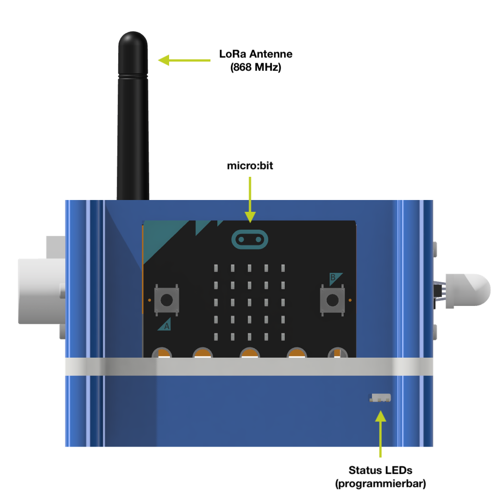
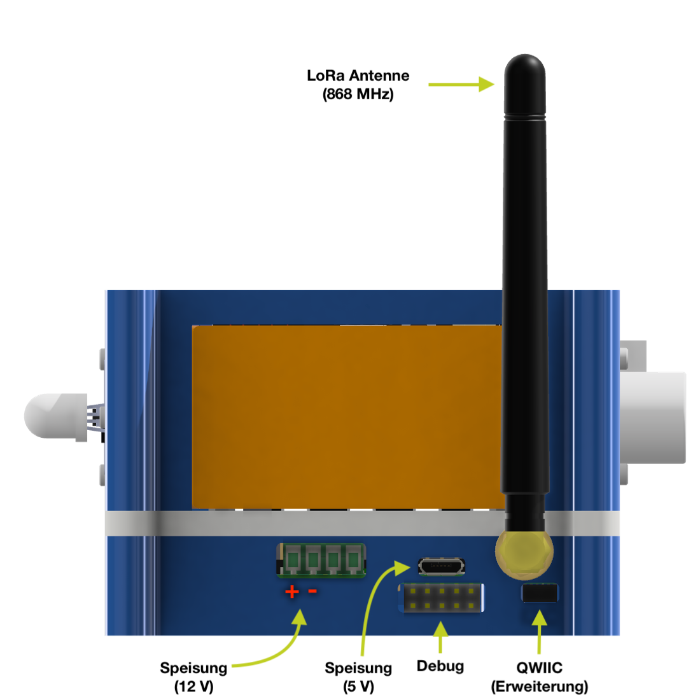
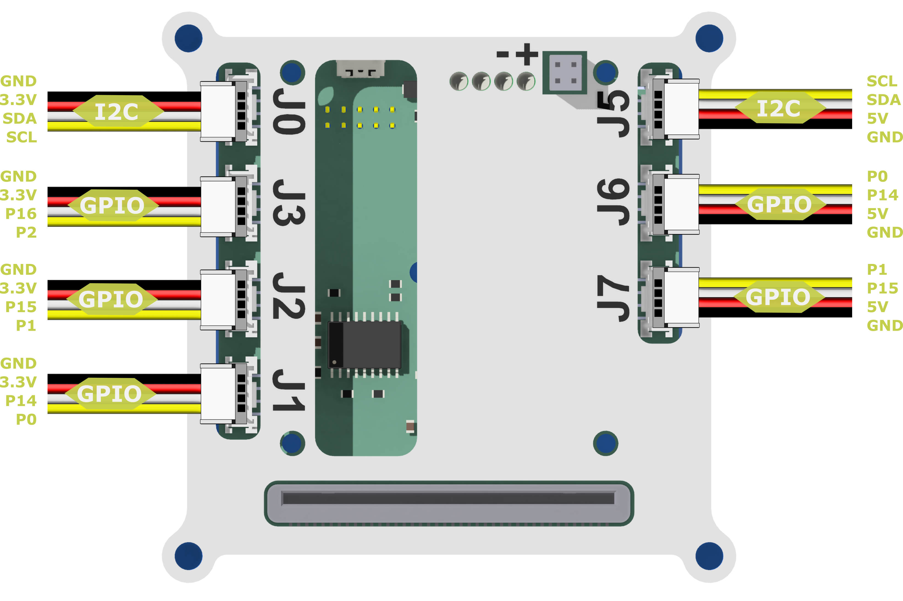
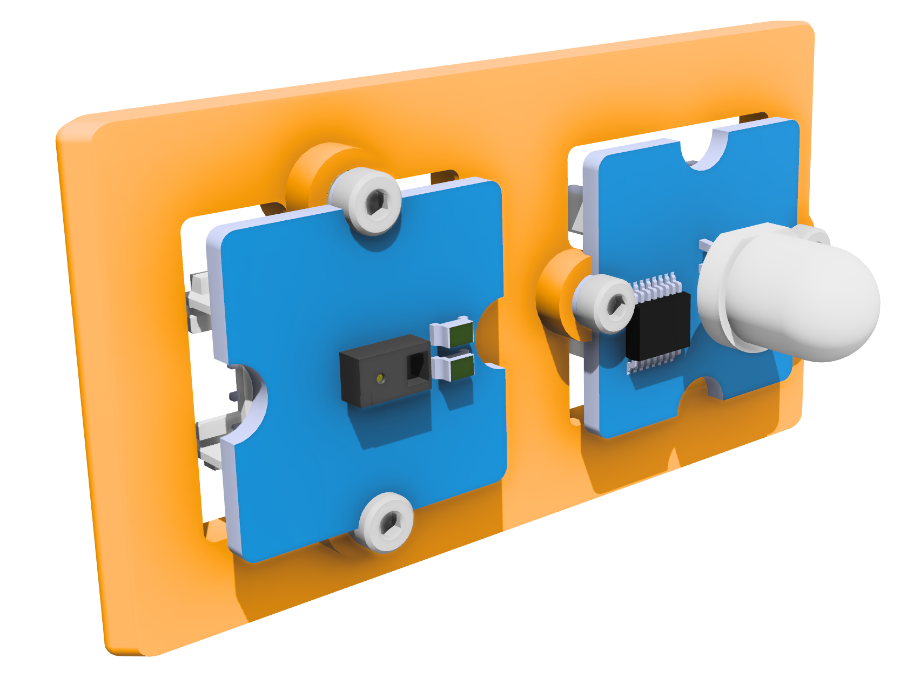
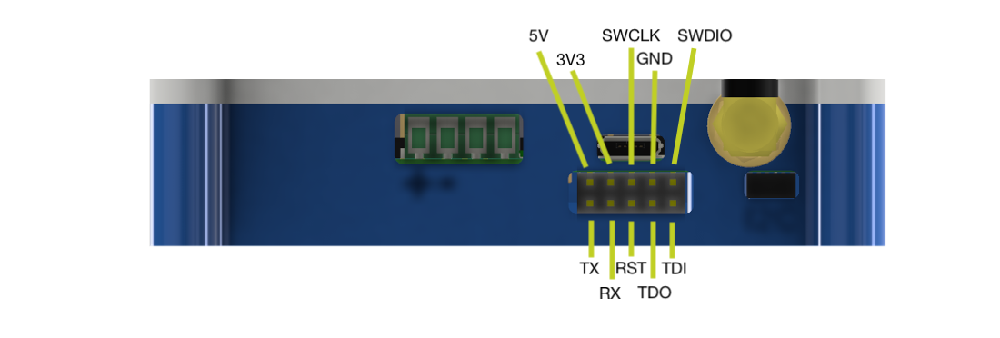

# Hardware

Der IoT-Würfel besteht aus micro:bit, Erweiterungsboard und einem 3D-Druck Gehäuse. Weiter können individuelle Grove Sensoren am Gehäuse befestigt werden. Dieser Teil der Dokumentation dient der Referenz zu IoT-Würfel spezifischen Eigenschaften, welche bei der Verwendung zu berücksichtigen sind.

| Vorderseite                            | Rückseite                            |
| -------------------------------------- | ------------------------------------ |
|  |  |

## Grove Anschlüsse

Die Grove Anschlüsse sind Teil eines verbreiteten Systems um verschiedenste Sensoren und Aktoren mit einem einheitlichen Kabel zu verbinden. Insgesamt 7 Grove Anschlüsse sind auf dem IoT-Würfel vorhanden. Die Anschlüsse J0, J1, J2 und J3 auf der linken Seite in der Abbildung sind für 3.3V Logik ausgelegt. Die rechte Seite mit J5, J6 und J7 sind auf 5V Logik.

| Anschluss | Logik | GPIO         | Beschreibung                                                 |
| --------- | ----- | ------------ | ------------------------------------------------------------ |
| **J0**    | 3.3 V | SDA SCL | I2C Bus für das Anschliessen integrierter Module mit erweiterter Funktionalität. Geeignet für I2C Module wie kombinierte Sensoren von Temperatur & Luftfeuchtigkeit |
| **J1**    | 3.3 V | P0 P14  | GPIO Pins vom micro:bit mit analog und digital Funktionalität. Geeignet für LED, Taster, Analog Sensoren, etc. |
| **J2**    | 3.3 V | P1 P15  | GPIO Pins vom micro:bit mit analog und digital Funktionalität. Geeignet für LED, Taster, Analog Sensoren, etc. |
| **J3**    | 3.3 V | P2 P16  | GPIO Pins vom micro:bit mit analog und digital Funktionalität. Geeignet für LED, Taster, Analog Sensoren, etc. |
| **J5**    | 5 V   | SDA SCL | I2C Bus mit 5 V Logik und Speisung.                          |
| **J6**    | 5 V   | P0 P14  | GPIO Pins auf 5 V Logik angepasst. Geeignet für digitale Ein- und Ausgänge mit 5 V Logik.  **Info:** Signal ist identisch wie bei **J1** aber mit höherer Spannung. |
| **J7**    | 5 V   | P1 P15  | GPIO Pins auf 5 V Logik angepasst. Geeignet für digitale Ein- und Ausgänge mit 5 V Logik.  **Info:** Signal ist identisch wie bei **J2** aber mit höherer Spannung. |

> Der I2C Bus wird vom Würfel im Hintergrund verwendet. Zusätzliche Kommunikation auf dem Bus ist möglich aber die Adresse **0x20** darf nicht verwendet werden.

## Seitenwände

Die Wände des Würfels sind austauschbar. So können spezifische Anpassungen vorgenommen werden um die gewünschten Sensoren und Aktoren zu montieren.

| Name           | Beschreibung                                                 | Bild                                                         |
| -------------- | ------------------------------------------------------------ | ------------------------------------------------------------ |
| Grove 1x1 Dual | Bei dieser Wand können zwei kleine (1x1) Grove Module befestigt werden. Die Montagelöcher sind für M2 inserts konzipiert und heben das Modul 2.4 mm von der wand ab um Platz für das Kabel zu schaffen. |  |
| Grove 1x2      | Auf dieser Wand hat ein Grove Modul der grösse 1x2 Platz. Montage ist über einen M2 Gewindeeinsatz und passenden Schrauben möglich. |  |

## Rückseite

Auf der Rückseite befinden sich die Anschlüsse für die Speisung des Boards und erweiterte Funktionalität. Die Wand des Würfels kann Ersetzt und für eigene Wünsche angepasst werden.

### Anschlüsse

Auf der Rückseite befinden sich weitere Anschlüsse des Erweiterungsboards. Darunter Antenne, Debug, Power und QWIIC.

#### Schraubklemme

Die Schraubklemme (grün) hat 4 Anschlüsse für Litzen. Die Pins von links nach rechts:

| Speisung +   | Speisung - (GND)               | Open Collector 1                                             | Open Collector 2                                             |
| ------------ | ------------------------------ | ------------------------------------------------------------ | ------------------------------------------------------------ |
| Maximal 15 V | Referenzpunkt für die Speisung | Ansteuern von Lasten (z.B. LED Streifen) mit einem höheren Potenzial | Ansteuern von Lasten (z.B. LED Streifen) mit einem höheren Potenzial |

#### Micro USB

Der Micro USB dient zur einfachen Speisung mit 5 V. Die Datenleitungen vom USB werden nicht verwendet und sind für die Speisung optimiert.

#### Debug (optional)

Ein Pin-Socket mit 10 Anschlüssen ermöglicht den Zugriff auf Interne Komponenten und wird nur für Fehlerbehebung und Firmware Update des LoRa Moduls verwendet. Die Pinbelegung ist wie in der Tabelle und Abbildung illustriert. 

|           |   Links   |    ...    |  ...  | ...  | Rechts |
| :-------: | :-------: | :-------: | :---: | :--: | :----: |
| **Oben**  |    5V     |    3V3    | SWCLK | GND  | SWDIO  |
| **Unten** | TX (UART) | RX (UART) | RESET | TDO  |  TDI   |

Wobei die Positionsangaben davon ausgehen, dass der Würfel von der Rückseite betrachtet wird und auf der Bodenplatte steht. Der 5V Pin ist Standardmässig über einen Solder-Jumper vom 5V Netz auf dem Board getrennt.

#### LoRa Antenne

Die LoRa Antenne wird am SMA Stecker angeschraubt. Im Betrieb sollte immer eine Antenne angeschlossen sein zum Schutz des Funk Moduls. Das Modul ist für 868 MHz LoRa Kommunikation konfiguriert und muss mit einer passenden Antenne betrieben werden.

> Das Verwenden des Würfels ohne Antenne kann das Funkmodul beschädigen

#### QWIIC

Der [qwiic](https://www.sparkfun.com/qwiic) Anschluss ist ein Standard von sparkfun und basiert auf I2C. Über diesen Anschluss können weitere Module angeschlossen werden. Die Speisung mit 3.3 V sowie Clock und Data sind im Anschluss vorhanden.

