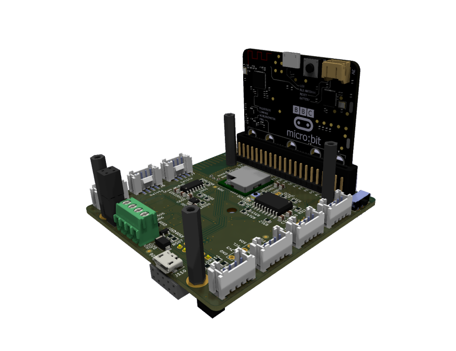

# IoT-Würfel

Das ist die Dokumentation und Anleitung für die Makecode-Erweiterung IoT-Cube

- [Blöcke](blocks.md)

- [Beispiele](examples.md)

## Als Erweiterung verwenden

Dieses Repository kann als **Erweiterung** in MakeCode hinzugefügt werden.

* öffne [https://makecode.microbit.org/](https://makecode.microbit.org/)
* klicke auf **Neues Projekt**
* klicke auf **Erweiterungen** unter dem Zahnrad-Menü
* nach **https://github.com/paeber/lora-at-interface** suchen und importieren

## Dieses Projekt bearbeiten 

Um dieses Repository in MakeCode zu bearbeiten.

* öffne [https://makecode.microbit.org/](https://makecode.microbit.org/)
* klicke auf **Importieren** und dann auf **Importiere URL**
* füge **https://github.com/paeber/lora-at-interface** ein und klicke auf Importieren

### Testen von Github Pages

Github pages basiert auf jekyll und kann mithilfe der Anleitung in einer lokalen Testumgebung überprüft werden: https://jekyllrb.com/docs/

```shell
# Run inside root folder of github repository
bundle exec jekyll serve
```




  <script src="https://makecode.com/gh-pages-embed.js"></script><script>makeCodeRender("{{ site.makecode.home_url }}", "{{ site.github.owner_name }}/{{ site.github.repository_name }}");</script>